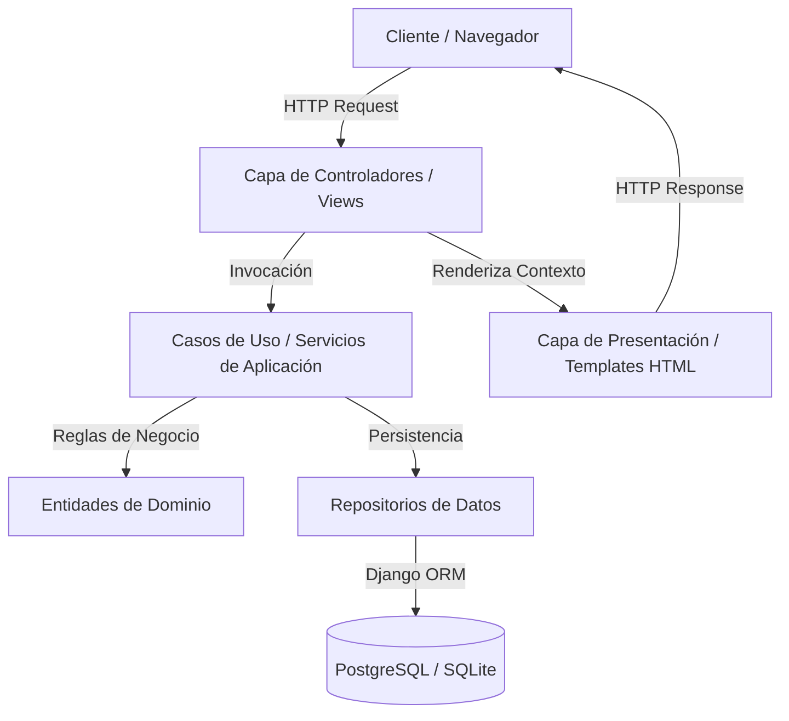
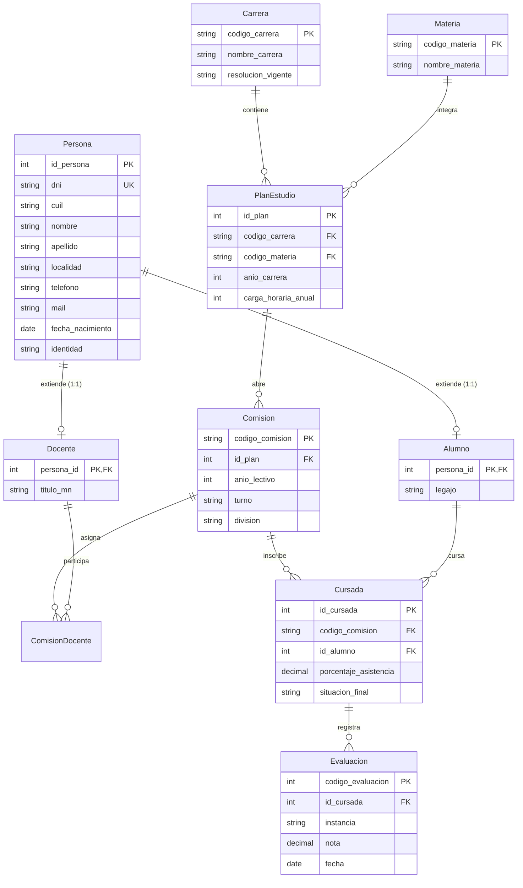

# Sistema de Gestión Académica (SGA) — ISFT N° 188

Plataforma web institucional orientada a la administración académica integral del Instituto Superior de Formación Técnica N° 188 (General Rodríguez, Provincia de Buenos Aires).

El sistema centraliza y optimiza la gestión de planes de estudio, carreras técnicas oficiales, matriculación de estudiantes, asignación docente, comisiones, actas de cursada, emisión de analíticos y la generación del Libro Matriz reglamentario.

---

> [!NOTE]
> **Proyecto de Prácticas Profesionales:** Este sistema fue desarrollado desde cero durante las prácticas profesionales formativas. Todos los datos cargados en esta versión pública (estudiantes, calificaciones, docentes, teléfonos y domicilios) son **100% ficticios y generados algorítmicamente** con fines demostrativos. El catálogo de carreras y materias refleja planes de estudio curriculares públicos.

---

## 1. Problema que Resuelve y Destinatarios

### Problema
Históricamente, los institutos de educación superior técnica administran la información mediante planillas de cálculo dispersas y libros físicos manuscritos, lo que genera:
- Inconsistencias en los números de documento y CUIL entre legajos.
- Dificultades para consolidar el historial académico de los estudiantes al momento de emitir constancias.
- Tiempos prolongados en la confección manual del Libro Matriz anual exigido por la normativa educativa provincial.
- Falta de un canal de consulta unificado para estudiantes y docentes sobre sus estados de cursada y calificaciones.

### Destinatarios
- **Personal Directivo y Preceptoría:** Administración centralizada de legajos, carreras, planes de estudio, generación de Libro Matriz oficial y constancias analíticas.
- **Cuerpo Docente:** Visualización de sus comisiones asignadas, nóminas de alumnos y materias a cargo.
- **Estudiantes:** Consulta de historial curricular, porcentaje de asistencia, regularidad y materias cursadas.

---

## 2. Funcionalidades del Sistema por Rol

### Rol Administrativo / Directivo
- **Buscador Académico Unificado:** Localización ágil de estudiantes y docentes por DNI, CUIL, apellido o nombre, con visualización de ficha institucional completa y modal de edición rápida.
- **Carga Secuencial de Alumnos en 2 Pasos:**
  - *Paso 1:* Formulario validado con cálculo algorítmico del dígito verificador de CUIL (algoritmo oficial Módulo 11 de ANSES) y acumulación en matriz de sesión.
  - *Paso 2:* Confirmación por lotes e inserción atómica en base de datos.
- **Importación Masiva desde Excel:** Procesamiento de planillas `.xlsx` con normalización automática de caracteres, detección de duplicados y reporte detallado de filas procesadas y errores.
- **Generación del Libro Matriz Oficial:** Exportación dinámica en formato Excel normalizado respetando la disposición formal por folio, resolución y materias.
- **Emisión de Constancias Analíticas:** Generación de constancia de estado académico con cálculo dinámico de promedios en formato imprimible A4.
- **Gestión Curricular y de Carreras:** Alta, edición y visualización de tecnicaturas, materias correlativas, planes de estudio y comisiones por ciclo lectivo.
- **Gestión Docente:** Registro individual e importación masiva de docentes con titulación y asignación a comisiones.

### Rol Docente
- **Portal Docente:** Panel con las comisiones asignadas para el ciclo lectivo, turnos, horarios y materias a cargo.
- **Ficha Imprimible:** Consulta y descarga de la ficha de asignación docente institucional.

### Rol Alumno
- **Portal del Estudiante:** Visualización de las tecnicaturas en las que está inscripto, materias cursadas, porcentaje de asistencia acumulado, estado de aprobación (Promocionado, Final, Regular, Libre) y notas de parciales.

---

## 3. Stack Tecnológico y Arquitectura

### Stack Tecnológico
- **Lenguaje:** Python 3.12+
- **Framework Web:** Django (Arquitectura MTV desacoplada)
- **Base de Datos:** PostgreSQL en producción / SQLite local para desarrollo con `PRAGMA foreign_keys = ON` activado
- **Frontend:** Django Templates + Tailwind CSS + Vanilla JavaScript
- **Manejo de Hojas de Cálculo:** `openpyxl`
- **Archivos Estáticos:** WhiteNoise
- **Servidor WSGI:** Gunicorn
- **Contenedorización:** Docker & Docker Compose

### Arquitectura de Software (Patrón MTV / Clean Architecture)

El proyecto organiza sus responsabilidades desacoplando la lógica de negocio y la persistencia de los controladores web a través de un contenedor de dependencias (`config/contenedor.py`):



---

## 4. Modelo de Datos (Diagrama Entidad-Relación)



---

## 5. Puesta en Marcha Local (Paso a Paso)

### Requisitos Previos
- Python 3.12 o superior instalado.
- Git instalado.

### Opción A: Ejecución Nativa con SQLite

1. **Clonar el repositorio:**
   ```bash
   git clone https://github.com/Uri46/sga-isft-188-public.git
   cd sga-isft-188-public
   ```

2. **Crear y activar un entorno virtual:**
   ```bash
   # En Windows
   python -m venv venv
   .\venv\Scripts\activate

   # En Linux / macOS
   python3 -m venv venv
   source venv/bin/activate
   ```

3. **Instalar dependencias:**
   ```bash
   pip install -r requirements.txt
   ```

4. **Configurar el entorno:**
   Copiar la plantilla de variables de entorno:
   ```bash
   # En Windows (PowerShell / CMD)
   copy .env.example .env

   # En Linux / macOS
   cp .env.example .env
   ```
   > [!IMPORTANT]
   > **Avisos de Seguridad y Despliegue:**
   > - `DEBUG`: Viene configurado en `False` por defecto en la plantilla `.env.example`. El sistema sirve los archivos estáticos (CSS, JS, logos SVG) de forma optimizada y segura a través de WhiteNoise tanto en local como en producción.
   > - `SECRET_KEY`: En cualquier despliegue real o servidor público, genere una clave única, secreta y aleatoria.
   > - `ADMIN_PASSWORD`: Modifique la contraseña del usuario administrador (`admin1234`) por una clave robusta en cualquier entorno productivo.


5. **Aplicar migraciones:**
   ```bash
   python manage.py migrate
   ```

6. **Crear usuario administrador de prueba:**
   ```bash
   python manage.py crear_usuario_admin
   ```
   *(Crea el usuario `admin` con la contraseña configurada en `.env`, por defecto `admin1234`).*

7. **Cargar datos de demostración sintéticos:**
   ```bash
   python manage.py seed_data --alumnos 30 --docentes 10
   ```

8. **Recolectar archivos estáticos (requerido para WhiteNoise con DEBUG=False):**
   ```bash
   python manage.py collectstatic --noinput
   ```

9. **Iniciar el servidor de desarrollo:**
   ```bash
   python manage.py runserver
   ```
   Acceder desde el navegador a: `http://127.0.0.1:8000/login/`

---

### Opción B: Ejecución con Docker & Docker Compose

El proyecto incluye soporte para PostgreSQL contenerizado y arranque unificado.

1. Configurar `.env` a partir de `.env.example`:
   ```bash
   copy .env.example .env
   ```
   Asegurarse de definir `DB_PASSWORD=una_clave_segura` en el archivo `.env`.

2. Construir y levantar los contenedores:
   ```bash
   docker-compose up --build
   ```

3. Sembrar datos de prueba dentro del contenedor:
   ```bash
   docker-compose exec web python manage.py seed_data
   ```

4. Ingresar en el navegador a `http://localhost:8000`.

---

## 6. Usuarios de Prueba para la Demostración

| Rol | Usuario (Identificador) | Contraseña | Destino inicial |
|---|---|---|---|
| **Directivo / Admin** | `admin` | `admin1234` | Buscador General y Gestión |
| **Docente (Demo)** | `25000000` *(DNI del primer docente)* | `123456789` | Portal Docente |
| **Estudiante (Demo)** | `40000000` *(DNI del primer estudiante)* | `123456789` | Portal del Alumno |

*(Nota: Todos los docentes y alumnos generados por el comando `seed_data` pueden ingresar utilizando su número de DNI como usuario y `123456789` como clave inicial del portal).*

---

## 7. Pruebas Automatizadas

El proyecto cuenta con una suite completa de pruebas unitarias y de integración que validan el flujo de autenticación, control de acceso por roles, cálculo de CUIL, matriculación y generación de reportes:

```bash
python manage.py test tests
```
> Resultado verificado: **75 tests ejecutados exitosamente (OK)**.

---

## 8. Capturas de Pantalla

[AGREGAR CAPTURA: Pantalla de inicio de sesión con selección de tema claro/oscuro]

[AGREGAR CAPTURA: Buscador general de alumnos y docentes con filtros]

[AGREGAR CAPTURA: Formulario interactivo de carga de alumnos en dos pasos]

[AGREGAR CAPTURA: Catálogo institucional de carreras y planes de estudio]

[AGREGAR CAPTURA: Constancia analítica oficial de alumno en formato imprimible]

[AGREGAR CAPTURA: Portal de autogestión del estudiante]

---

## 9. Equipo

Proyecto desarrollado en equipo durante las prácticas profesionales del ISFT N° 188, desde el relevamiento de requerimientos hasta el desarrollo.

- Franco Diaz
- Eduardo Mendez
- Nehuen Mattea
- Franco Ruffin
- Thomas Espejo
- Hector Uriel Taño
- Emmanuel Villalba
